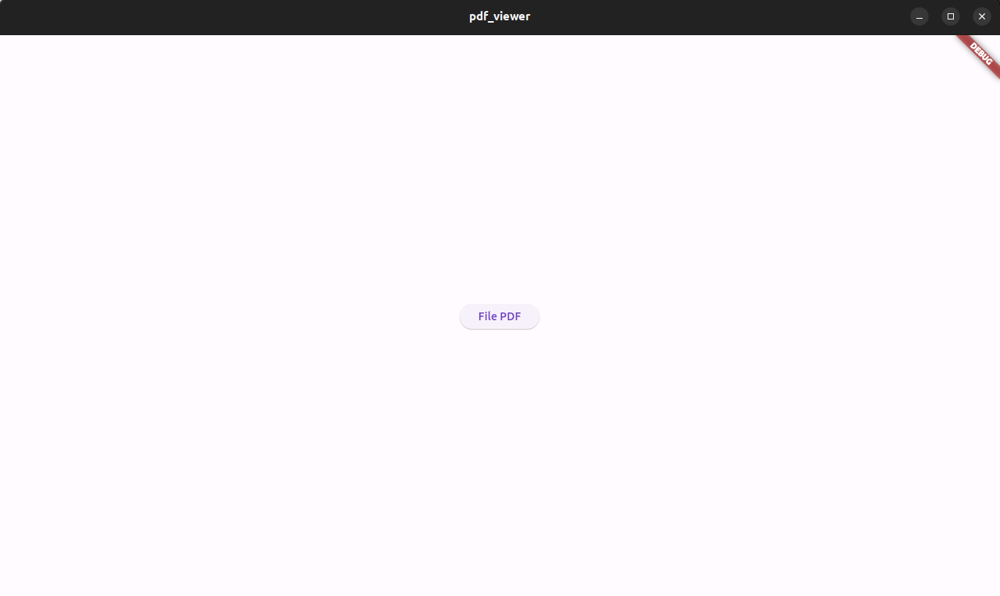
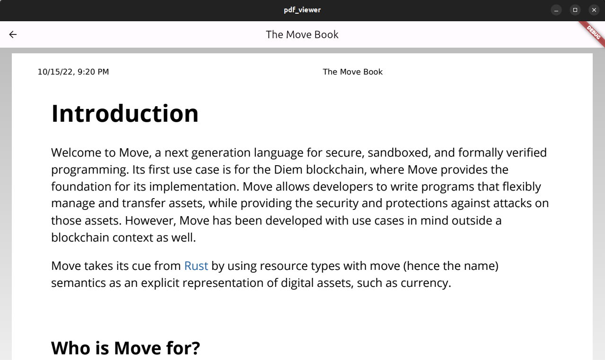
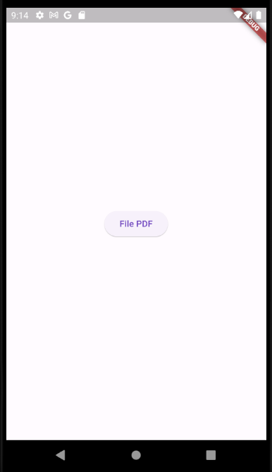
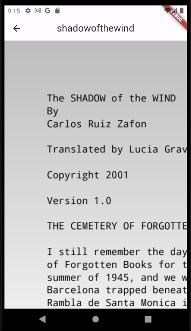

# pdf_viewer

Sample project of a pdf viewer app that is multiplatform. This project works on Android, IOS, Web, Mac, Windows and Linux.

  
  

  
  

## Languages, Frameworks and Libraries Used

- Dart, Flutter
- http
- path
- path_provider
- file_picker
- file_selector
- pdf
- printing